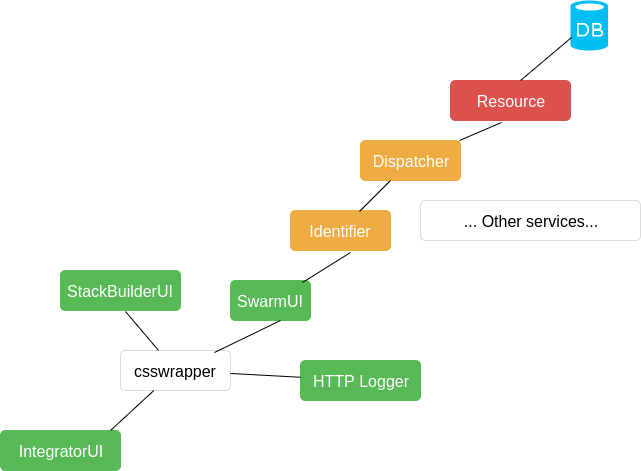

# Big Data Integrator (BDI) Integrated Development Environment (IDE)

The **Big Data Integrator** is an application that can be thought as a "starter kit" to start working and implementing big data pipelines in your process. It is the minimal standalone system so you can create a project with multiple docker containers, upload it & make it run using a nice GUI.

# Architecture

You can think of the Big Data Integrator as a *placeholder*. It acts as a "skeleton" application where you can plug & play different big data services from the [big data europe](https://github.com/big-data-europe) platform, and add and develop your own services.

At it's core it is a simple web application that will render each different service's frontends inside it, so it is easy to navigate between each system providing a sense of continuity in your workflow.

The basic application to start from is constituted of several components:

  * [Stack Builder](https://github.com/big-data-europe/app-stack-builder): this application allows users to create a personalized **docker-compose.yml** file describing the services to be used in the working environment. It is equipped with hinting & search features to ease discovery and selection of components.
  * [Swarm UI](https://github.com/big-data-europe/app-swarm-ui): after the docker-compose.yml has been created in the *Stack Builder*, it can be uploaded into a github repository, and from the **SwarmUI** users can clone the repository and launch the containers using docker swarm from a nice graphical user interface, from there one can start, stop, restart, scale them, etc...
  * [HTTP Logger](https://github.com/big-data-europe/app-http-logger): provides logging of all the http traffic generated by the containers and pushes it into an elasticsearch instance, to be visualized with kibana.
    * Containers to be observed must run *always* with the `logging=true` label activated.
    * When visualizing data in Kibana, please make sure to specify the **hars*** pattern for the index so that the data can be discovered.
    * For more information about this please follow the link and read the documentation of the **HTTP Logger** itself.
  * [Workflow Builder](https://github.com/big-data-europe/app-pipeline-builder): it helps define a specific set of steps that have to be executed in sequence, as a "workflow". This adds functionality like docker healthchecks but more fine-grained. To allow the *Workflow Builder* to enforce a workflow for a given stack (docker-compose.yml), the [mu-init-daemon-service](https://github.com/big-data-europe/mu-init-daemon-service) needs to be added as part of the stack. It will be the "referee" that imposes the steps defined in the workflow builder. For more information check it's repository.


Systems are organized following a microservices architecture and run together using a docker-compose script, some of them sharing microserviecs common to all architectures, like the *identifier*, *dispatcher*, or *resource*. This is a more visual representation of the basic architecture:


  


# Installation & Usage

  * Clone the repository
  * from the root cloned directory run
  ```
  sudo ./scripts/install.sh
  ```
  * `docker-compose up -d` will run the services together.
  * Visit `integrator-ui.big-data-europe.aksw.org` to access the application's entry point.


# How to add new services (Iframe)

  * Add the new service(s) to **docker-compose.yml**, it is important to expose the **VIRTUAL_HOST** & **VIRTUAL_PORT** environment variables for the frontend application of those services, to be accessible by the integrator (e.g):

  ```yml
    new-service-frontend:
      image: bde2020/new-service-frontend:latest
    links:
      - csswrapper
      - identifier:backend
    expose:
      - "80"
    environment:
      VIRTUAL_HOST: "new-service.big-data-europe.aksw.org"
      VIRTUAL_PORT: "80"
  ```

  * Add an entry in **/etc/hosts** to point the url to localhost (or wherever your service is running) (e.g):

  ```sh
  127.0.0.1 workflow-builder.big-data-europe.aksw.org
  127.0.0.1 swarm-ui.big-data-europe.aksw.org
  127.0.0.1 kibana.big-data-europe.aksw.org
  (..)
  127.0.0.1 new-service.big-data-europe.aksw.org
  ```

  * Modify the file **integrator-ui/user-interfaces** to add a link to the new service in the integrator UI.

  ```json
  {
    "data": [
      ...etc .. ,
      {
        "id": 1,
        "type": "user-interfaces",
        "attributes": {
          "engine": false,
          "repo-name": "my-new-service",
          "label": "My new Service",
          "base-url": "http://new-service.big-data-europe.aksw.org/",
          "append-path": ""
        }
      }
    ]
  }
  ```


# How to add new services (ember-engines)

If the new service frontend to be added is an **ember-engine** instead of a standalone frontend image, the process is a little different. Since the engine is part of the integrator-ui (added as an addon), there is no longer need of adding a new service into the **docker-compose.yml** file, since it will be using the integrator-ui's nginx server.

Adding a new service involves changing the **config/integrator-ui/user-interfaces** file to instruct the integrator-ui that that piece is an engine.

```json
{
  "data": [
    ...etc .. ,
    {
      "id": 1,
      "type": "user-interfaces",
      "attributes": {
        "engine": true,
        "repo-name": "ember-stack-builder-frontend",
        "label": "Stack Builder",
        "base-url": "",
        "append-path": ""
      }
    }
  ]
}
```

Some remarks:

  * **engine**: it is set to true to specify this frontend piece is an engine.
  * **repo-name**: this is a little tricky. This name must match the name you use in the **router.js** file of your application, for it to create a link that matches with the name of the engine.
  * **base-url**: for engines it *must* be empty for the engines.

# NOTES:

There is a random startup error on **swarm-admin** that is on Work In Progress and will prevent users form working with the project. This happens because of the delta forwarding a call to a database that is not yet available. 

	* If `drc ps` shows swarm-admin exited or `drc logs swarm-admin` shows an exception, that is the problem.
	* `drc up -d swarm-admin` will boot up the service once the database has been fully loaded.
